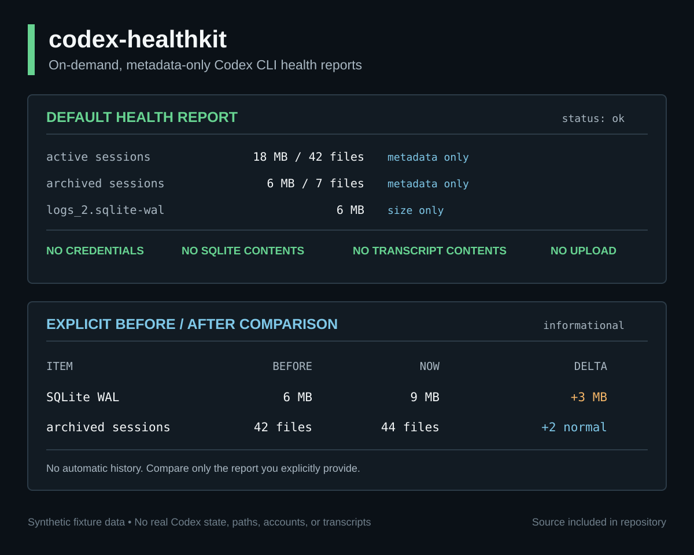

# codex-healthkit

[](https://github.com/Ishikawa-Hidekazu/codex-healthkit/actions/workflows/ci.yml)
[](LICENSE)
[](https://github.com/Ishikawa-Hidekazu/codex-healthkit/releases)

Codexが動いていても、local sessionsやSQLite WALは静かに増えることがあります。`codex-healthkit`は、credentials、database本文、transcript本文を開かず、その増加を確認します。

[English](README.md)

`codex-healthkit` は、Codexを日常的に使う人向けの、必要な時だけ実行するCLI health reportです。debug、issue作成、相談の前に、local sessionとSQLite WALのmetadataを確認できます。

デフォルトでは`codex`を実行せず、認証情報、token、cookie、SQLite本文、session transcript本文を読みません。daemon、dashboard、常駐監視、session recorderではなく、background serviceやWeb UIも不要です。OpenAI公式のプロジェクトではありません。

## 30秒で試す

default modeに必要なのはBashと標準的なUnix toolsだけです。`codex`は実行しません。

```bash
git clone --depth 1 https://github.com/Ishikawa-Hidekazu/codex-healthkit.git
cd codex-healthkit
./bin/codex-healthkit check
```

確認可能なMarkdown health reportをstdoutへ出します。daemonのinstall、Codex stateの変更、
reportのuploadは行いません。

## 24秒のterminal demo


demoは合成fixture値だけを使っています。実際のCodex home、account、path、report、
database、transcriptは含みません。

## 何が出るか

<picture>
  <source media="(max-width: 600px)" srcset="assets/source/health-report-mobile.svg">
  
</picture>

[public-safeなtext sample](examples/report.redacted.md) ·
[再現可能なvisual source](assets/source/README.md)

## 一番狭いmodeを選ぶ

| mode | 用途 | 境界 |
| --- | --- | --- |
| health report | `./bin/codex-healthkit check` | local metadataだけ。`codex`を実行しない |
| before / after | `./bin/codex-healthkit check --compare before.json` | 明示したhealth reportを1件比較。自動historyなし |
| optional doctor | `./bin/codex-healthkit check --with-codex-doctor` | official `codex doctor --json`を明示実行。provider到達性checkの可能性あり |
| JSON output | health reportまたは比較へ`--json`を追加 | 同じdataを機械処理しやすい形式で出力 |

最初はdefault checkから始めてください。これが一番狭いモードで、`codex` を実行しません。

## 何のためのツールか

Codexを日常的に使っていると、次のような確認が必要になることがあります。

- ローカルのCodex関連ファイルが大きくなっていないか
- active / archived session が増えすぎていないか
- SQLite WALファイルが大きくなっていないか
- 誰かに相談するとき、何なら安全に共有できるか

`codex-healthkit` は、この範囲に絞った点検ツールです。利用量ダッシュボード、アカウント切り替え、クリーンアップ、transcript解析ツールではありません。

## ステータス

source-only CLIです。最新のtagged releaseは `v0.4.0` です。

最初の通常releaseも、意図的に狭く、読み取り専用にしています。
公開済みsource revisionを固定してcloneする場合は`--branch v0.4.0 --depth 1`を指定します。

macOSとLinuxで検証済みです。WindowsはこのBash実装では未対応です。

## 誰のためのものか

`codex-healthkit` は、次のような人向けです。

- Codexを頻繁に使う
- ローカル状態を素早く確認したい
- 共有前に自分で確認できるレポートが欲しい
- credential、transcript、account dataを不用意に出したくない

issueを開く前、ローカル状態を時系列で見たいとき、他の開発者に相談する前の確認に向いています。

## 実運用での3つの使い方

1. **Codex CLI更新の前後:** JSON reportを1件保存し、通常どおり更新した後、automatic historyなしでWALとsession metadataを比較します。
2. **日々の運用点検:** active sessions、archived sessions、quarantine、SQLite filesが増えていないかを確認し、詳細調査が必要か判断します。
3. **support requestの準備:** 小さなreportを作り、自分で確認したうえで、issueに関係するredacted metadataだけを共有します。

## よく使うコマンド

JSON health report:

```bash
./bin/codex-healthkit check --json
```

レポート保存:

```bash
./bin/codex-healthkit check > codex-health-report.md
./bin/codex-healthkit check --json > codex-health-report.json
```

明示的な前回レポートと比較:

```bash
./bin/codex-healthkit check --json > before.json
# Codex CLIを更新する、1日待つ、通常作業をする
./bin/codex-healthkit check --json --compare before.json
```

2つ目のコマンドで `--json` を外すと、Markdownの比較表として読めます。

## ローカルインストール

local `PATH`へ置く場合:

```bash
git clone --branch v0.4.0 --depth 1 https://github.com/Ishikawa-Hidekazu/codex-healthkit.git
cd codex-healthkit
mkdir -p ~/.local/bin
ln -sf "$PWD/bin/codex-healthkit" ~/.local/bin/codex-healthkit
codex-healthkit check
```

保存したreportを消さず、local commandだけをuninstallする場合:

```bash
rm ~/.local/bin/codex-healthkit
```

cloneしたsource directoryが不要なら、別途削除します。

## 確認するもの

デフォルトの `codex-healthkit check` は、次を確認します。

- `codex` コマンドが存在するか。デフォルトでは実行しません
- active session directory のサイズと `.jsonl` 数
- archived session directory のサイズと `.jsonl` 数
- quarantine directory のサイズ
- `logs_2.sqlite`, `logs_2.sqlite-shm`, `logs_2.sqlite-wal` のファイルサイズ
- サイズだけを見た `ok` / `watch` の簡易サマリー

SQLiteデータベースやsession transcriptの中身は開きません。
また、デフォルトでは外部の `codex` コマンドも実行しません。

## オプション

```text
codex-healthkit check [--markdown|--json] [--compare <previous-report.json>] [--sessions-total-advisory-bytes <bytes>] [--sessions-daily-growth-advisory-bytes <bytes>] [--with-codex-version] [--check-latest-codex] [--with-codex-doctor]
codex-healthkit --version
codex-healthkit --help
```

### `--compare`

明示的に指定した過去の `codex-healthkit check --json` レポートを読み、現在のmetadata-only値と比較します。

通常のMarkdown出力では読みやすい差分表として、`--json` では機械処理しやすいdeltaとして出力します。

比較するもの:

- `logs_2.sqlite-wal` のサイズ
- `logs_2.sqlite` のサイズ
- active session directory のサイズと `.jsonl` 数
- archived session directory のサイズと `.jsonl` 数
- quarantine directory のサイズ

このモードには `jq` が必要です。historyを自動保存せず、telemetry送信もせず、SQLiteの中身やsession transcriptの中身は読みません。

比較結果には、過去と現在の`generated_at`から検証した比較間隔と、active sessionsのbyte差分を1日換算した値も含まれます。`2026-08-01T00:00:00Z`のようなUTC timestampだけを受け付け、不正、同一、逆転した時刻では誤った値を出さず、日次換算を利用不可にします。

sessions advisoryは、整数byteの閾値を明示した場合だけ有効です。

```bash
codex-healthkit check --json --compare before.json \
  --sessions-total-advisory-bytes 32212254720 \
  --sessions-daily-growth-advisory-bytes 4294967296
```

- `--sessions-total-advisory-bytes`は`large_total`を理由として追加する場合があります。
- `--sessions-daily-growth-advisory-bytes`は`rapid_growth`を理由として追加する場合があります。
- 閾値指定には`--compare`が必要です。`30G`のようなhuman-size文字列は受け付けません。
- advisoryはsummary statusやexit codeを変更しません。
- デフォルトでは閾値は無効で、cleanupや削除も行いません。
- 機械可読なcomparison contractは[`schemas/comparison-v0.2.schema.json`](schemas/comparison-v0.2.schema.json)にあります。

### `--with-codex-version`

次を実行します。

```bash
codex --version
```

Codex CLIのバージョンをレポートに含めたい場合だけ使います。

### `--check-latest-codex`

インストール済みのCodex CLIを、公式npmのstableな`latest` dist-tagと比較します。

```bash
codex-healthkit check --json --check-latest-codex
```

このoptionは`--with-codex-version`を含みます。公開されている`@openai/codex`のmetadata endpointへHTTPS GETを1回だけ送り、解決された`executable_path`、`current_version`、`latest_version`、`update_available`をreportします。実行ファイルの内容は読まず、PATHの優先順による差だけを見えるようにします。

- defaultでは無効で、通常checkはlocal-onlyのままです
- `curl`と`jq`が必要です
- `.curlrc`を読み込まず、authorization、cookie、token headerを送りません
- timeoutは5秒、retryは0回です
- Codexのinstallやupdateは行いません
- 確認失敗はsummary statusやexit codeを変更しません
- default JSON outputにversion-check fieldを追加しません

### `--with-codex-doctor`

default checkでは`codex`を実行しません。公式Codex CLI doctorのsummaryも必要な場合だけ、
このoptionを明示的に指定します。

指定した場合だけ、次を実行します。

```bash
codex doctor --json
```

重要:

- このモードには `jq` が必要です
- Codex CLIが既存のCodex設定を通じてprovider到達性チェックを行う場合があります
- このモードは完全オフラインとは言えません
- `codex-healthkit` がreportするのは、redactedされた`status`、`ok`、`warn`、`fail`、noteだけです
- rawの `codex doctor` 出力はレポートに含めません
- session transcript本文とSQLite本文は読みません
- cleanup、delete、usage dashboard機能は追加しません

## 出力例

[examples/report.redacted.md](examples/report.redacted.md) を参照してください。

短い例:

```text
# codex-healthkit report

- summary: ok
- codex command found: yes
- codex version: not requested
- sessions: 42 files, 18M
- archived sessions: 7 files, 2.1M
- SQLite WAL: 0B
- auth files read: no
- session transcript contents read: no
```

## 結果の読み方

レポートのsummaryは、意図的にシンプルにしています。

- `ok`: サイズだけの確認では、大きなSQLite/WALの増加は見つかっていません
- `watch`: ローカルメタデータのどれかが大きく、確認した方がよい状態です
- `fail`: optional official doctor modeを実行し、公式 `codex doctor` がfailureを返した状態です

`watch` は、認証情報が漏れたという意味ではありません。SQLiteの中身を読んだという意味でもありません。

詳しくは [docs/usage.md](docs/usage.md) と [docs/faq.md](docs/faq.md) を参照してください。

## 安全境界

`codex-healthkit` は次を読みません。

- `~/.codex/auth.json`
- token files
- cookies
- localStorage
- OS credential stores
- SQLite contents
- session transcript contents
- account IDs or email addresses

`codex-healthkit` はsessions配下の `.jsonl` ファイル数を数えますが、rawのファイル名はレポートしません。

レポートは確認後にissueへ貼りやすい形を目指していますが、共有前にはユーザー自身で必ず確認してください。

詳しくは [docs/safety-boundary.md](docs/safety-boundary.md) を参照してください。

## ドキュメント

- [Usage guide](docs/usage.md)
- [FAQ](docs/faq.md)
- [Safety boundary](docs/safety-boundary.md)
- [Release checklist](docs/release-checklist.md)
- [English README](README.md)

## やらないこと

`codex-healthkit` は次を行いません。

- Codexアカウント切り替え
- auth fileの解析
- transcriptからの利用量やquota推定
- sessionの削除、archive、cleanup
- browser profileの読み取り
- レポートのアップロード
- background telemetry

## 既知の非対応範囲

- 増加原因の特定やCodex stateの修復は行いません。
- fileの削除、archive、compact、cleanupは行いません。
- account usage、quota、rate limitは推定しません。
- automatic historyは保持しません。比較には明示的な過去JSON reportが必要です。
- default checkはsize/countの観測で、SQLite integrity checkではありません。
- このBash実装はWindowsに対応していません。
- optional official doctorの挙動は、installed Codex CLIにより変わる可能性があります。

## 必要なもの

デフォルトモード:

- macOSまたはLinux。WindowsはこのBash実装では未対応です
- Bash
- 標準的なUnix tools: `find`, `du`, `stat`, `awk`, `wc`, `tr`

比較mode:

- `jq`

optional doctor mode:

- Codex CLI
- `jq`

## 開発

チェック実行:

```bash
bash -n bin/codex-healthkit scripts/render-visuals.sh tests/run.sh tests/fixtures/fake-bin/codex
shellcheck bin/codex-healthkit scripts/render-visuals.sh tests/run.sh tests/fixtures/fake-bin/codex
tests/run.sh
```

## 困ったとき

何かおかしいと感じた場合:

1. まずdefault checkを実行してください。
2. レポートを自分で確認し、必要な箇所をredactしてください。
3. 近いissue templateからissueを作成してください。

最初のtroubleshooting:

```bash
./bin/codex-healthkit --help
bash --version
command -v find du stat awk wc tr
```

`--compare`または`--with-codex-doctor`が使えない場合は`command -v jq`も確認します。
doctor modeにはofficial `codex` CLIも必要です。

public issueには、credentials、tokens、cookies、private paths、raw session transcripts、raw `codex doctor` outputを貼らないでください。

[SUPPORT.md](SUPPORT.md) を参照してください。

## 安全にissueを開くには

issueを開くときは:

- 近いissue templateを使ってください
- 実行したcommandを書いてください
- OSを書いてください
- 自分で確認し、redactした出力だけを貼ってください
- 期待した結果と実際の結果を書いてください

確認していないraw reportは貼らないでください。

## コントリビュート

小さく焦点の合った貢献を歓迎します。特に次のようなものは助かります。

- documentation improvements
- safer examples
- fixture-based tests
- Linux compatibility checks
- shell portability fixes

pull requestを開く前に [CONTRIBUTING.md](CONTRIBUTING.md) と [CODE_OF_CONDUCT.md](CODE_OF_CONDUCT.md) を確認してください。

## セキュリティ

public issueには、credentials、tokens、cookies、private paths、raw session transcripts、raw `codex doctor` outputを含めないでください。

[SECURITY.md](SECURITY.md) を参照してください。

## Changelog

[CHANGELOG.md](CHANGELOG.md) を参照してください。

## ロードマップ

近い範囲:

- source-only releaseの日次利用を継続
- fixture-based testsの追加
- report exampleの改善
- 実用改善がまとまった段階で次releaseを判断

新しい安全レビューが必要な範囲:

- account switching
- transcript parsing
- usage estimation
- automatic cleanup
- background monitoring
- npm package distribution

## ライセンス

MITです。[LICENSE](LICENSE) を参照してください。
